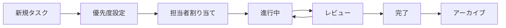

# 📝 プロジェクト タスク管理

## 📋 概要

この `tasks.md` ファイルは プロジェクトのタスク管理と進捗確認を行うための中心的なドキュメントです。開発チームと AI Agents が現在取り組んでいるタスク、今後の計画、完了した項目を一元的に管理し、プロジェクト全体の透明性を高めることを目的としています。

## 🎯 目的

- ✅ プロジェクトの現在および将来のタスクを明確化する
- 📊 各タスクの進捗状況を追跡し、ボトルネックを特定する
- 🤝 チームメンバー間の認識合わせとコミュニケーションを促進する
- 🗺️ プロジェクトの目標達成に向けたロードマップを提供する
- 🆙 頻繁に更新することで、工程管理を効率化する

## 🔄 運用方法

### タスク管理フロー

### ステータス管理

- 🔴 **未着手** `[ ]` - まだ開始していないタスク
- 🟡 **進行中** `[◐]` - 現在取り組んでいるタスク
- 🔵 **レビュー中** `[R]` - 完了したが確認待ちのタスク
- 🟢 **完了** `[x]` - 完全に完了したタスク
- ⚪ **保留** `[H]` - 一時的に停止しているタスク

## 🚀 プロジェクト進捗ダッシュボード

### 全体進捗サマリー

| レイヤー           | 進捗 | 状態     | 優先度 |
| ------------------ | ---- | -------- | ------ |
| ------------------ | ---  | -------- | ------ |

## 📋 タスクリスト

---

## 📝 更新ログ
